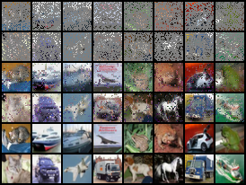

# masked_mae_cifar10
Implementation of Masked MAE ( Masked Autoencoders Are Scalable Vision Learners, 2021) on CIFAR-10 dataset

Result: 
The first two rows are masked input, the second two are reconstructed output and last two are ground truth. 

Author:
Akansh Maurya

